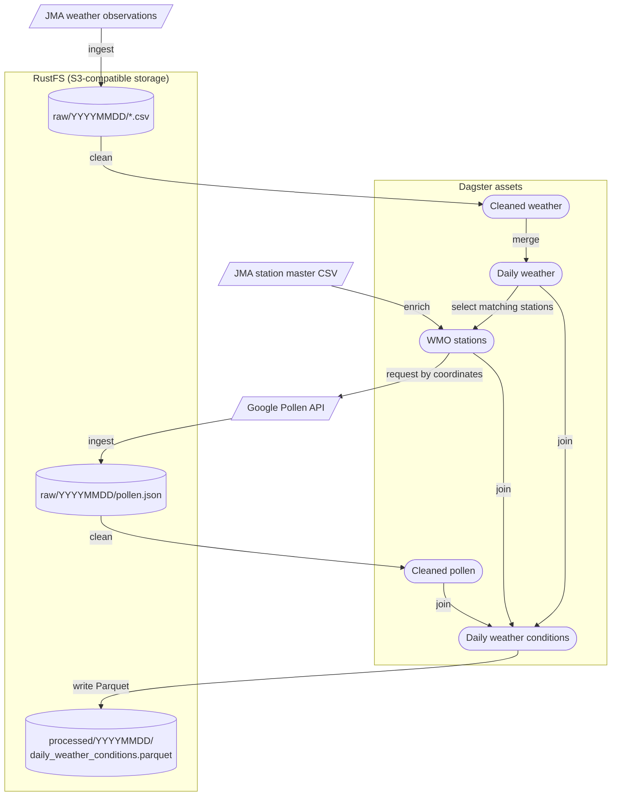

# JP Weather ETL

A Dagster-based ETL pipeline for weather data in Japan

Inspired by live weather reports, this pipeline runs on demand instead of on a fixed schedule. Each run creates a snapshot of the observations available so far that day.

## Setup

Set up environment variables:

```sh
cp .env.example .env
```

Start storage and Dagster:

```sh
make dev
```

The Dagster UI is available at http://localhost:3000, the S3 API at
http://localhost:9000, and the RustFS console at http://localhost:9001.

## Architecture



## Data Sources

Weather observation data and station master data are provided by the [Japan Meteorological Agency (JMA)](https://www.data.jma.go.jp/stats/data/mdrr/docs/csv_dl_readme.html).

Pollen data is provided by the [Google Maps Platform Pollen API](https://developers.google.com/maps/documentation/pollen).

## License

[MIT](./LICENSE)

`data/station_master.csv` is subject to the JMA's applicable terms of use, as it contains data provided by the JMA.

Copyright (c) 2026-present, Akinori Hoshina
