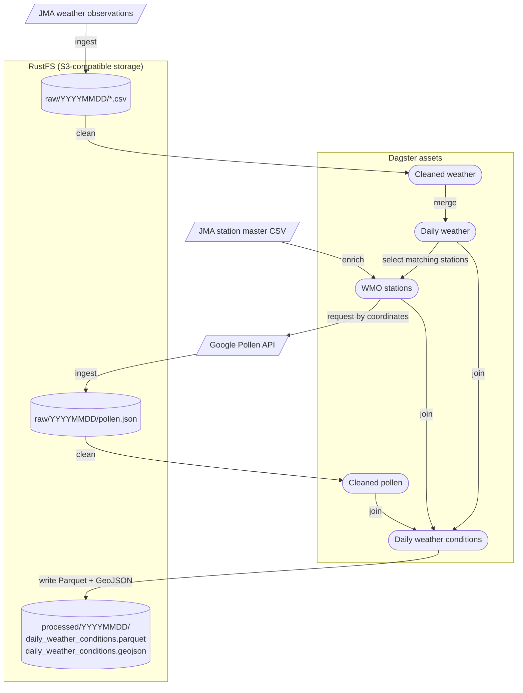

# JP Weather ETL

A Dagster-based ETL pipeline for weather data in Japan

This pipeline runs on demand and creates a snapshot of the observations available so far that day rather than running on a schedule, as the project is mainly for learning Dagster and runs locally. The concept is inspired by live weather reports.

## Setup

Install the project dependencies:

```sh
uv sync
```

Set up environment variables:

```sh
cp .env.example .env
```

Start storage and Dagster:

```sh
make dev
```

The Dagster UI is available at http://localhost:3000, the S3 API at
http://localhost:9000, and the RustFS console at http://localhost:9001.

## Jobs

| Name                  | Description                                        |
| --------------------- | -------------------------------------------------- |
| `weather_etl_job`     | Fetch raw data and build today's snapshots.        |
| `weather_rebuild_job` | Rebuild today's snapshots from existing raw files. |

## Pipeline Architecture



## SQL Analytics

Processed weather snapshots can be queried directly with DuckDB.

Example:

```console
$ make query SQL="SELECT date, station_name, max_temperature_c FROM hottest(DATE '2026-09-16')"
┌────────────┬──────────────┬───────────────────┐
│    date    │ station_name │ max_temperature_c │
│    date    │   varchar    │      double       │
├────────────┼──────────────┼───────────────────┤
│ 2026-09-16 │ 鹿児島       │              32.1 │
└────────────┴──────────────┴───────────────────┘
```

| Name                     | Arguments                                                | Description                                                 |
| ------------------------ | -------------------------------------------------------- | ----------------------------------------------------------- |
| `all_weather_conditions` | `p_date DATE`                                            | Returns all weather conditions on the date.                 |
| `hottest`                | `p_date DATE`                                            | Returns the highest maximum temperature on the date.        |
| `coldest`                | `p_date DATE`                                            | Returns the lowest minimum temperature on the date.         |
| `highest_precipitation`  | `p_date DATE`                                            | Returns the highest precipitation on the date.              |
| `strongest_gust`         | `p_date DATE`                                            | Returns the strongest gust on the date.                     |
| `nearest_stations`       | `p_date DATE`, `p_latitude DOUBLE`, `p_longitude DOUBLE` | Returns the nearest station to the coordinates on the date. |
| `daily_summary`          | `p_date DATE`                                            | Returns a weather summary for the date.                     |

## Data Sources

Weather observation data and station master data are provided by the [Japan Meteorological Agency (JMA)](https://www.data.jma.go.jp/stats/data/mdrr/docs/csv_dl_readme.html).

Pollen data is provided by the [Google Maps Platform Pollen API](https://developers.google.com/maps/documentation/pollen).

## License

[MIT](./LICENSE)

`data/station_master.csv` is subject to the JMA's applicable terms of use, as it contains data provided by the JMA.

Copyright (c) 2026-present, Akinori Hoshina
